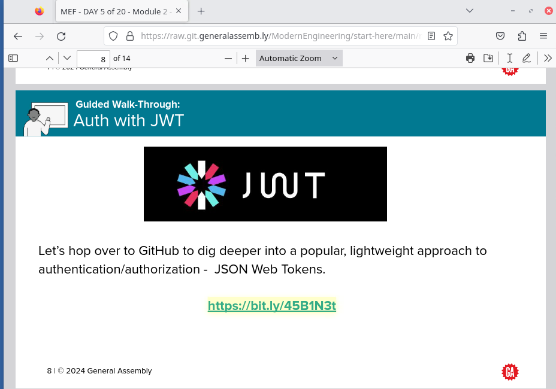
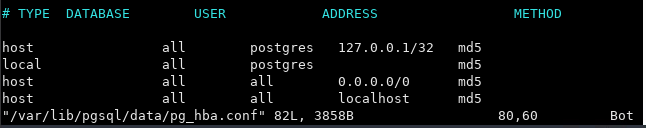

# Modern Engineering Fundamentals

## Getting Started - Cohort 5 January 2024


# Class Schedules

|          | Week 1                    | Week 2                    | Week 3                    | Week 4                    |
| -------- | ------------------------- | ------------------------- | ------------------------- | ------------------------- |
| Schedule | [View Schedule](./resources/week1.md) | [View Schedule](./resources/week2.md) | [View Schedule](./resources/week3.md) | [View Schedule](./resources/week4.md) |

## Deliverables Due Dates

|          | [Build Your own API]()                    | [Build Your Own Full Stack Application]()                   | [Selenium Testing Lab]()                    | [Dockerizing an Application]()                    |
| -------- | ------------------------- | ------------------------- | ------------------------- | ------------------------- |
| Due Date | 01/15 | 01/23 | 01/29 | 01/30|


<br>

## FAQ:

## Fork and Clone lessons/labs

1. On the top right corner of the repository, click the Fork button.

   

2. Select your Username as the destination for the fork.

3. Verify that the repository is under your username: `<GH_Username>/<repo_name>`

4. Click the green `code` button, then click the icon next to the SSH URL to copy the .git path.

   

5. Open the terminal and `cd` into your mef folder: `cd ~/mef`.

6. Next, select the destination where you want to save the repository then type: `git clone <paste_git_url_here>`

   

7. `cd` into the new directory and you're ready to code. Happy coding!

   <br>

## To commit and push your work to GitHub

1. In the VM Terminal, `cd` into the folder you want to push up.
2. Add your files to a staging mode: `git add -A`
3. _(Optional)_ - You can run `git status` to observe your files
4. Commit your files to version control: `git commit -m "PUT A DESCRIPTION OF WHAT YOU'RE COMMITTING HERE"`
5. _(Optional)_ - You can run `git status` to observe what you committed
6. _(Optional)_ - You can run `git log` to see a history of all your commits.
7. Push to GitHub: `git push`. You can now goto your repo on GitHub to see your new files.

<!-- NOTE - if you get an error, try `git push origin main`. Your primary branch will be named `master` or `main`. -->

   <!-- You can now goto your repo on GitHub to see your new files. NOTE - if you do not see your updates, please select the dropdown menu on the top right (it'll probably say "Main") and select the "Master" branch. -->

<br>

## Submitting Your Work via Pull Request

1. In your repository, click on Pull Requests which is placed underneath the repo name.
   
2. Click on the New pull request button.
   
3. Confirm that the base repository is the ModernEngineering org name and the head repository is your GH username. Once that's been verified, click on the Create pull request button.
   
4. In the Title input, type in `MEF - <your_first_name> <your_last_name>` then click on Create pull request to officially submit your lab or homework.
   

## To stop a running port

If you get a message that a port is in use, you can kill it with this command: `sudo kill -9 $(sudo lsof -t -i:3000)`

- Replace `3000` with the port number you want to stop.
- [Reference](https://tecadmin.net/kill-process-on-specific-port/)

## Viewing Slide Decks With Clickable URLS

When viewing a slide in the github repository if you > click on the download button.


You will then have the slide open in your browser window and any urls in the slide deck lesson will be clickable to direct you to further lesson resources / exercises.  In additional you can also navigate between slides by also typing in the slide page number to direct you in case you get lost at any time.



## Fixing PostgreSQL Authentication Error

* Before proceeding make sure that you have spelled the password correct which should be **postgres**

To resolve a PostgreSQL authentication error by setting the authentication method to `md5`, follow these steps:

1. **Open `pg_hba.conf` for Editing**:
   In the terminal, run:

   `sudo vi /var/lib/pgsql/data/pg_hba.conf`
   <br>

   This command opens the `pg_hba.conf` file in vi editor with superuser privileges.

2. **Enter Insert Mode**:
   - Press `i` to enter insert mode in vi, which allows you to make changes to the file.

   

3. **Edit Authentication Method**:
   - Find the line corresponding to the `postgres` user, typically:
   ```
   local   all   postgres   peer
   ```
   

- Change `peer` to `md5`:
  ```
  local   all   postgres   md5
  ```
  

4. **Save and Exit**:
   - Press `Esc` to exit insert mode and return to command mode.
   - Type `:wq` and then press `Enter` to save the changes and close the editor.

   

   <br>

5. **Restart PostgreSQL**:
Restart the PostgreSQL service to apply changes:

   - `sudo systemctl restart postgresql`

   


Now, PostgreSQL will use `md5` authentication for the `postgres` user.


## Additional Links
