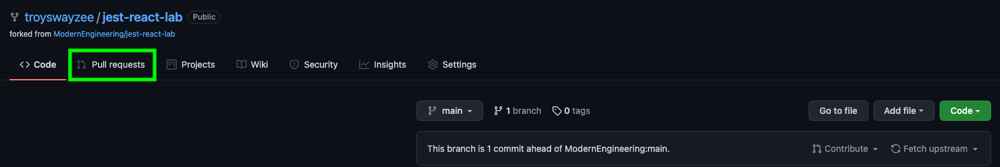
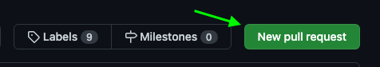

# Modern Engineering Fundamentals

## Getting Started - Cohort 5 January 2024

# Class Schedules

|          | Week 1                    | Week 2                    | Week 3                    | Week 4                    |
| -------- | ------------------------- | ------------------------- | ------------------------- | ------------------------- |
| Schedule | [View Schedule](./resources/week1.md) | [View Schedule](./resources/week2.md) | [View Schedule](./resources/week3.md) | [View Schedule](./resources/week4.md) |

 

## FAQ:

## Fork and Clone lessons/labs

1. On the top right corner of the repository, click the Fork button.

   

2. Select your Username as the destination for the fork.

3. Verify that the repository is under your username: `<GH_Username>/<repo_name>`

4. Click the green `code` button, then click the icon next to the SSH URL to copy the .git path.

   

5. Open the terminal and `cd` into your Documents folder: `cd ~/mef`.

6. Next, select the destination where you want to save the repository then type: `git clone <paste_git_url_here>`

   

7. `cd` into the new directory and you're ready to code. Happy coding!

    

## To commit and push your work to GitHub

1. In the VM Terminal, `cd` into the folder you want to push up.
2. Add your files to a staging mode: `git add -A`
3. _(Optional)_ - You can run `git status` to observe your files
4. Commit your files to version control: `git commit -m "PUT A DESCRIPTION OF WHAT YOU'RE COMMITTING HERE"`
5. _(Optional)_ - You can run `git status` to observe what you committed
6. _(Optional)_ - You can run `git log` to see a history of all your commits.
7. Push to GitHub: `git push`. You can now goto your repo on GitHub to see your new files.

<!-- NOTE - if you get an error, try `git push origin main`. Your primary branch will be named `master` or `main`. -->

   <!-- You can now goto your repo on GitHub to see your new files. NOTE - if you do not see your updates, please select the dropdown menu on the top right (it'll probably say "Main") and select the "Master" branch. -->

 

## Submitting Your Work via Pull Request

1. In your repository, click on Pull Requests which is placed underneath the repo name.
   
2. Click on the New pull request button.
   
3. Confirm that the base repository is the ModernEngineering org name and the head repository is your GH username. Once that's been verified, click on the Create pull request button.
   
4. In the Title input, type in `MEF - <your_first_name> <your_last_name>` then click on Create pull request to officially submit your lab or homework.
   

## To stop a running port

If you get a message that a port is in use, you can kill it with this command: `sudo kill -9 $(sudo lsof -t -i:3000)`

- Replace `3000` with the port number you want to stop.
- [Reference](https://tecadmin.net/kill-process-on-specific-port/)

## Additional Links
