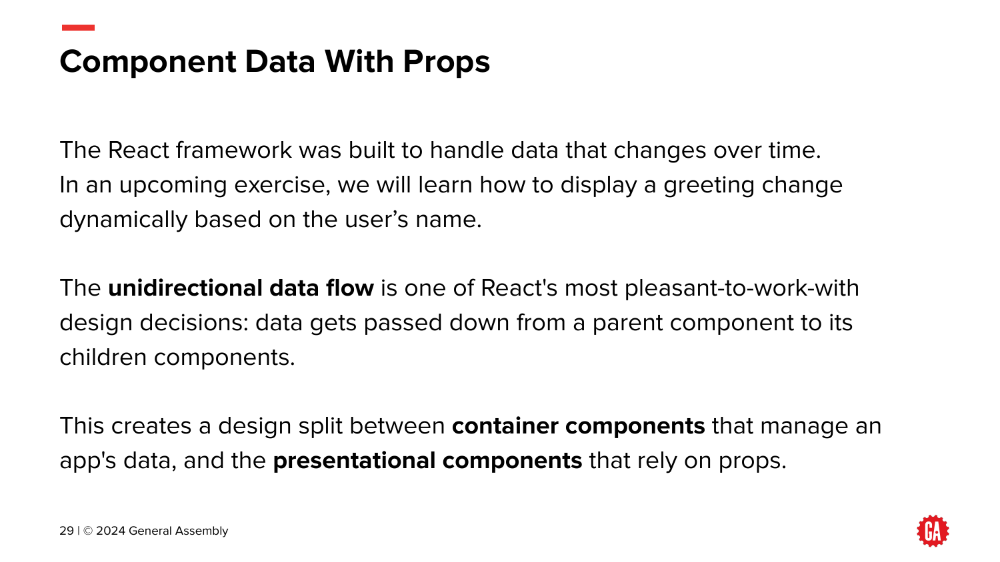
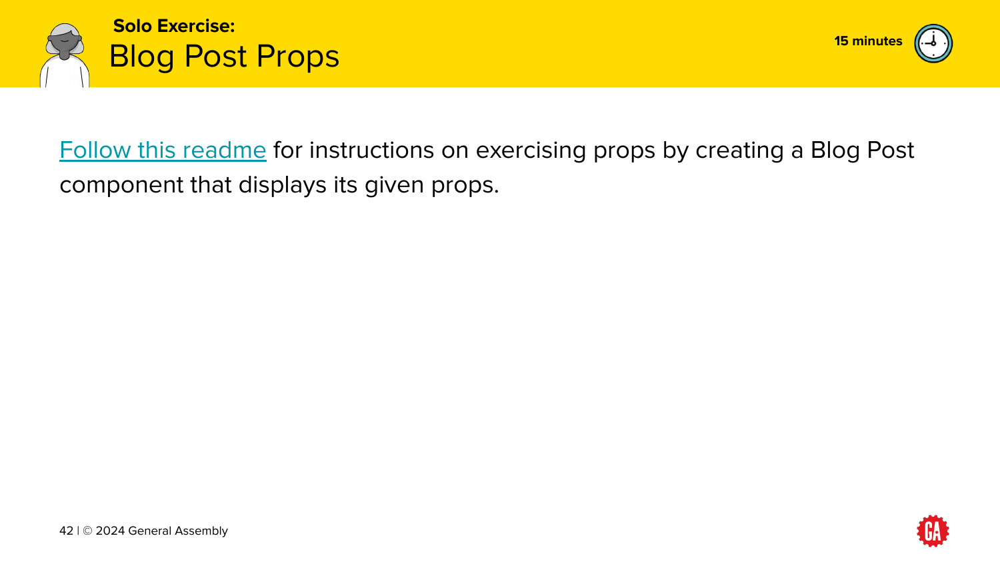
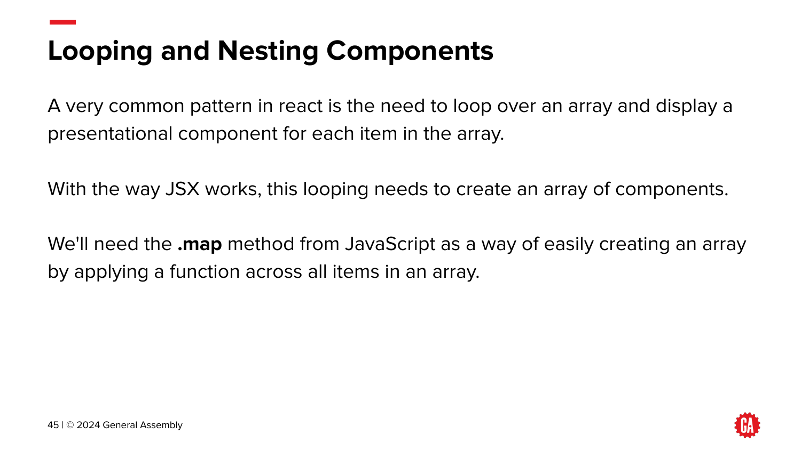

## [Week 2, Day 6](../week2.md)

### [React Foundations](https://git.generalassemb.ly/ModernEngineering/react-foundations)

<https://git.generalassemb.ly/ModernEngineering/react-foundations/blob/main/01-introduction.md>

        <https://generalassembly.wistia.com/medias/lr8idjxtx8>                                                
